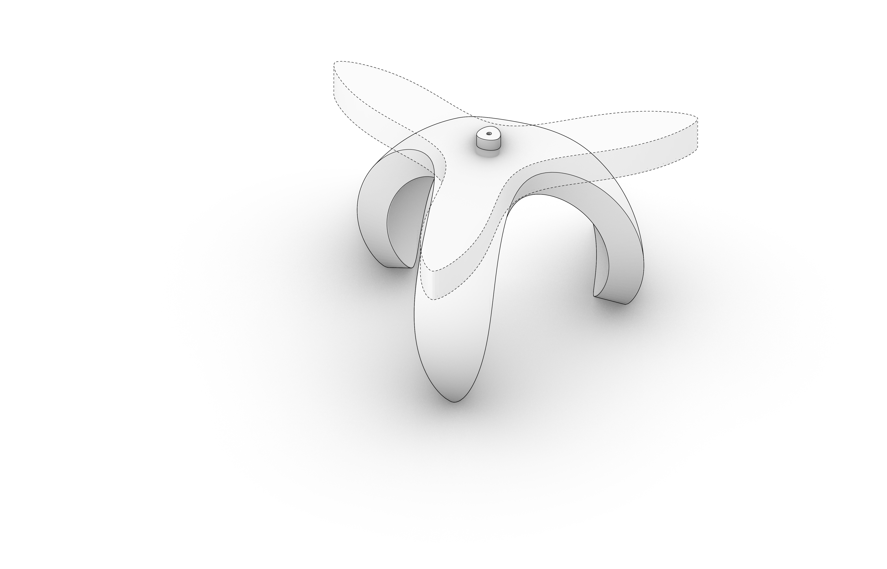
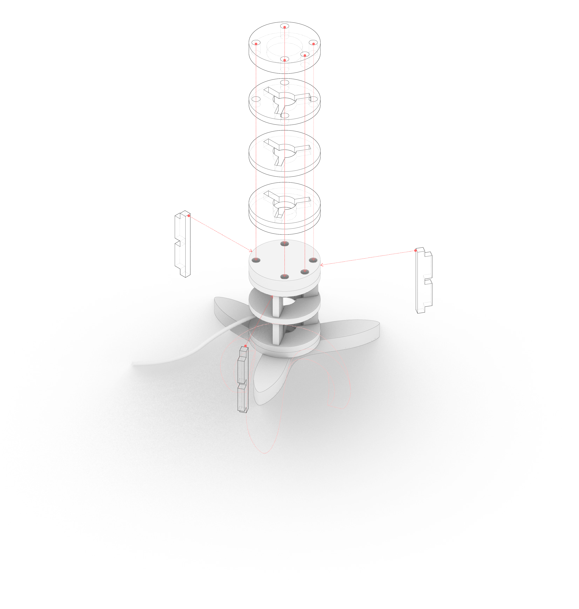
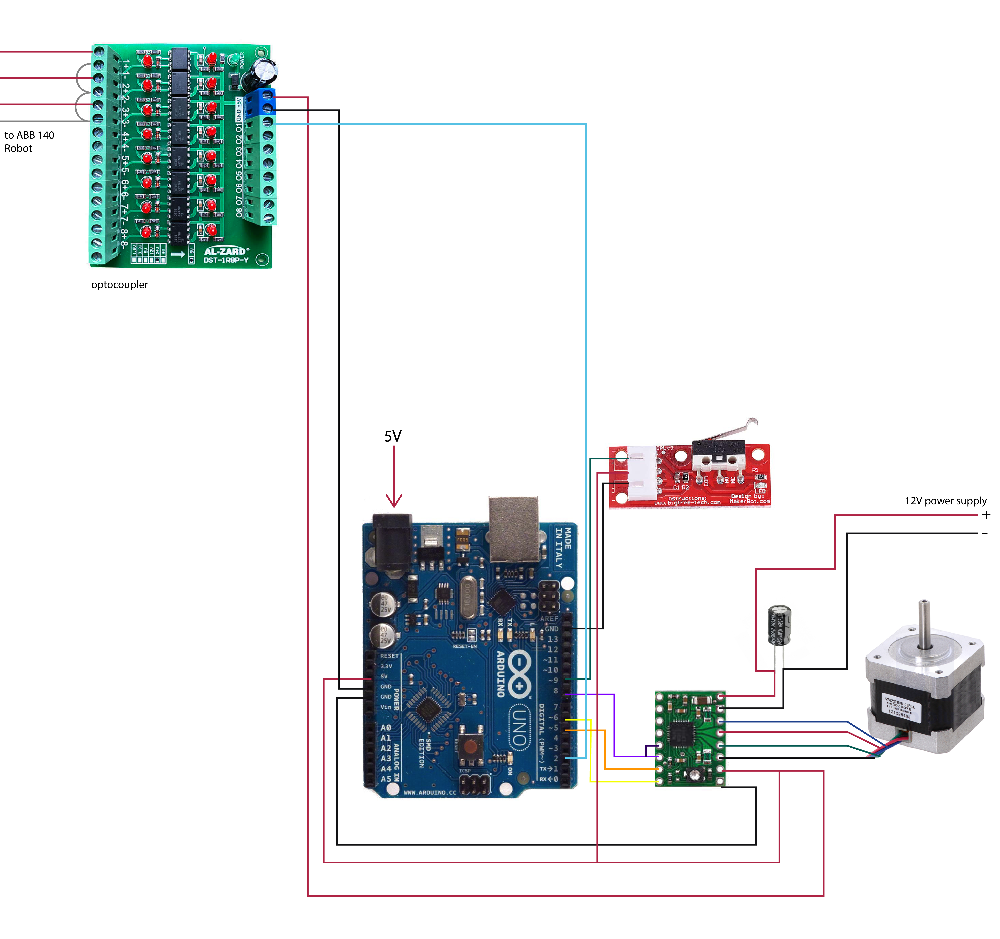

# Soft-Robotic-Gripper
The initial idea is to explore the state of the art in the area of soft robotics. They consist of inflatable parts that allow the flexibiity to be able to grab objects with different profiles and delicate/ fragile items. 
For the purpose of this excercise, we created a toolpath in which the soft gripper picks up a lightbulb and screws it into a desk lamp. 

# Requirements
**3D Parts:**

**For the syringe pump assembly**

* 50cm x 60cm Acrylic sheet
* M3X16mm Screws (28)
* M3X20mm Screws (14)
* M3X6mm Screws (4)
* Silicone Tubes (Diam. depends on the syringe used)
* Syringe 100ml (2)
* 6mm Steel Rod (Circle Profile)

**For the end effector**
* Acrylic (laser file for the end effector is placed in the same file as the acrylic base)
* EcoFlex 00-30 Silicone
* 3D Printed Mold

**Electronics:**

**Parts**
  * Arduino Uno
  * Nema 17 Stepper Motor
  * Stepper Driver (A4988)
  * 100 uF Capacitor
  * 12V Power Supply
  * Bread Board
  * End Stopper Sensor
  * M8 Lead Screw 
  * 5V Power Supply
  * Optocoupler
  * Several Jumper Wires
  

  
**Softwares:**
This project creates a simple syringe pump that is controlled by a stepper motor which receives signals from the optocoupler from an ABB140 Robotic Arm. A boolean statement is written within the arduino code, to determine whether the gripper inflates or deflates. 

 
  

  
  
# Getting Started
Download the arduino code

Follow the wiring diagram in order to make sure that the arduino code will be successfully uploaded into the arduino uno. Next, connect the arduino uno to the optocoupler, and the homing process that is written in the arduino code should start. The homing process identifies the starting position, once a binary signal is released from the optocoupler, the motor is triggered to turn on, therefore inflating the soft gripper. As written in the notes in the arduino code, the binary signals 0/1 determine whether the motor rotates clockwise or counter clockwise. 

# Credits
**SOFT ROBOTIC GRIPPER // HARDWARE I** is a project of IAAC, Institute for Advanced Architecture of Catalonia developed at the **Master in Robotics and Advanced Construction** in **2020/2021** by:

Students: **Hendrik Benz, Michael DiCarlo, Aslinur Taskin**

Faculty: **Angel Munoz**

Faculty Assistant: **Matthew Gordon**
